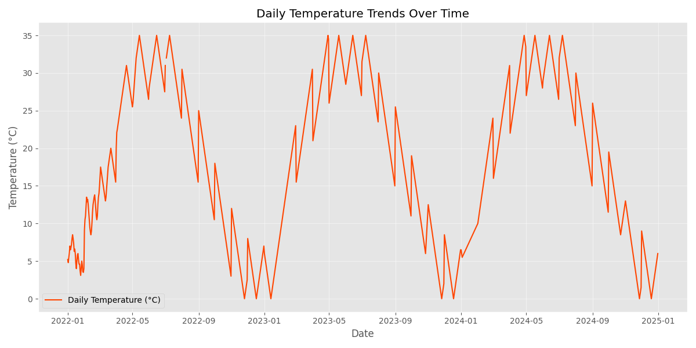
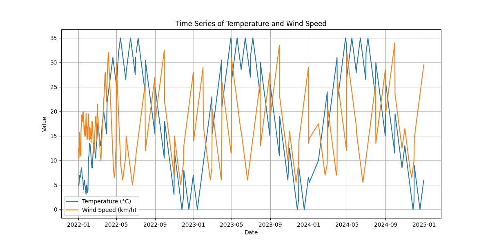
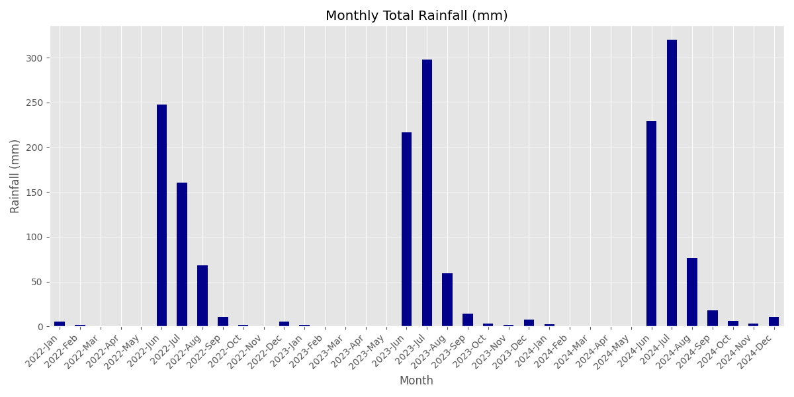
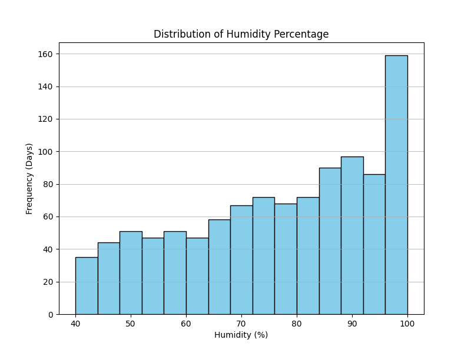

# Daily Weather Data Analyser

## 📝 Overview

> This repository contains the code and documentation for the Weather Data Analysis project. The primary goal was to clean, process, and analyze a three-year dataset of daily weather readings (Temperature, Rainfall, Humidity, Wind Speed) to identify key meteorological trends and seasonal patterns in Delhi.

## 💾 Dataset Description

- **Dataset Name:** Daily Weather Records 

- **Source:** Local File Upload (```weather_data.csv```)

- **Size:** 1096 total rows (representing 3 years of daily data), 5 columns.

### Key Features

| Feature         | Description                        |
| --------------- | ---------------------------------- |
| `Date`          | Calendar date for each observation |
| `Temperature_C` | Recorded daily temperature (°C)    |
| `Rainfall_mm`   | Daily rainfall amount (mm)         |
| `Humidity_perc` | Humidity percentage (%)            |
| `WindSpeed_kmh` | Wind speed measured in km/h        |
| `City`          | Geographic location of data source |

## 🛠 Tools and Technologies Used

This project utilized the following primary tools and libraries, implemented in the ``main.py`` script:

### Data Preprocessing Steps

- **Cleaning:** Missing values in ``Rainfall\_mm`` and ``Temperature\_C`` were identified and filled using the median of their respective columns.

- **Transformation:** The Date column was converted to a pandas ``datetime`` object and set as the DataFrame index for time-series analysis.

- **Feature Engineering:** No new features were explicitly engineered beyond basic time-series indexing.

### Data Handling and Analysis

- **Pandas:** For efficient data loading, cleaning, time-series resampling (monthly/seasonal aggregation), and statistical calculation.

- **NumPy:** For underlying numerical operations.

### Visualization and Reporting

- **Matplotlib:** For creating line plots, histograms, and bar charts to visualize trends.
  
- **OS Module and Print Statements:** For structured logging and saving results to ``analysis\_report.txt`` and plots to a dedicated ``plots/`` directory.

## 📈 Results and Key Findings

### Key Insights from ```analysis\_report.txt```

- **Temperature Extremes:** The maximum recorded temperature was $35^\circ \text{C}$ and the minimum was $0^\circ \text{C}$.

- **Wettest Months:** The months of July ($778.00\text{mm}$ total rainfall) and June ($693.50\text{mm}$ total rainfall) were overwhelmingly the wettest, aligning with the Monsoon season.

- **Driest Months:** April and May recorded the lowest rainfall.

| Season | Avg Temp | Total Rainfall | Avg Humidity |
| ------ | -------- | -------------- | ------------ |
| Winter | 7.27°C   | 38.7 mm        | 86.83%       |
| Spring | 26.64°C  | 0.2 mm         | 54%          |
| Summer | 27.94°C  | 1675.5 mm      | 77.67%       |
| Autumn | 15.37°C  | 53.3 mm        | 88.56%       |
|        |          |                |              |

## 🖥️ Visualization with Matplotlib

### 📈 Daily Temperature Trends Over Time


### 💨 Time Series of Temperature and Wind Speed


### 🌧️ Monthly Total Rainfall (mm)


### 💧 Distribution of Humidity Percentage

